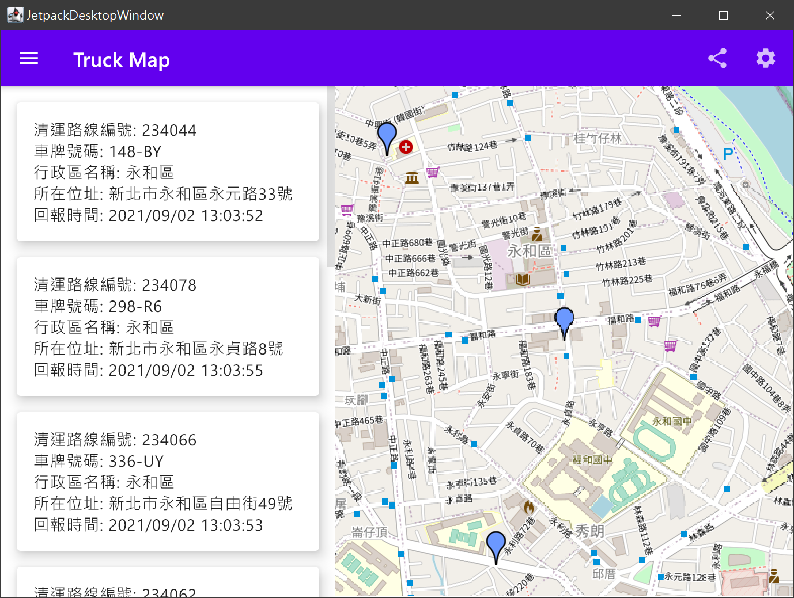

# ComposeTruck

### Description
A kotlin multiplatform app for getting garbage trucks location and routing quickly.

---
### Screenshot 
#### JVM:

---
### TODO
 - [x] get truck location
 - [ ] get truck routing
 - [ ] android app
 - [ ] jvm desktop app (wip)
### Data Source
- NTPC OpenData API: 
https://data.ntpc.gov.tw/openapi/swagger-ui/index.html?configUrl=%2Fopenapi%2Fswagger%2Fconfig&urls.primaryName=%E6%96%B0%E5%8C%97%E5%B8%82%E6%94%BF%E5%BA%9C%E7%92%B0%E5%A2%83%E4%BF%9D%E8%AD%B7%E5%B1%80(39)
